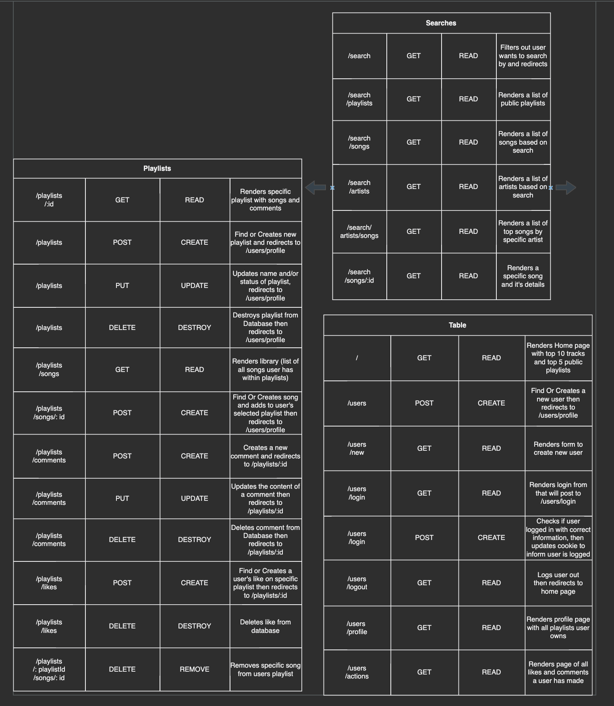
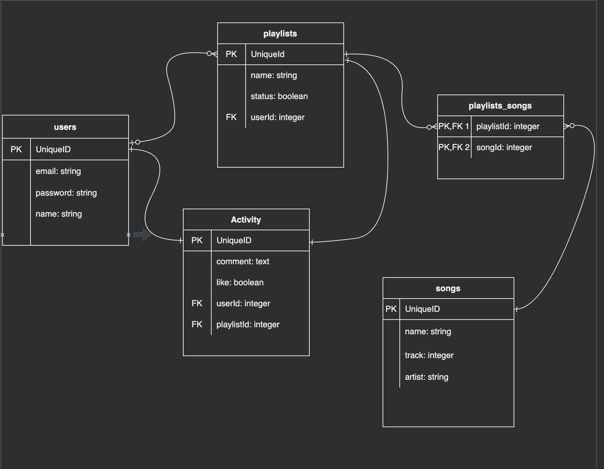

# HalfBeat
An application where you can look up your favorite songs and see the artist and lyrics corresponding to them. Also allowing you to search by artists and viewing their top tracks. This app allows you to create your own playlists where you can control their privacy status which means that you can choose to share your playlists to the public. Not only can you view someone else's playlist but you can also like and comment on them as well.

## Deployed link
<a href='https://roberto-project-two-1114.herokuapp.com/'>Link to App</a>

## Image of main goals with descriptions

## Technologies Used
* Javascript
* HTML
* CSS
* Postgresql
* EJS
* Node.js
* Express
* Sequelize 
* Bcrypt
* Crypto-js
* Method-Override
* Axios

## API's used
* Musixmatch - provided all the song information and allowed to search
* [musixmatch Link](https://developer.musixmatch.com/documentation)
* Last.fm - provided the album images for the songs
* [Last.fm Link](https://www.last.fm/api/intro)
* Dicebear - provides images for the character avatars
* [Dicebear Link](https://dicebear.com/styles/bottts)

## Installation instructions
* Fork and clone this repository
* Once in the terminal, run npm install within the cloned directory
* Create an environment file using touch .env
* If node_modules is not located inside a .gitignore file you will have to **echo node_modules >> .gitignore** along with **echo .env >> .gitignore**
* Inside of the .env file you will have to include a API_KEY='your musixmatch api key', OTHER_KEY='your last.fm api key', and SECRET='your secret'
* Run the following sequelize commans in your terminal to create and migrate the models and database used for this project: **sequelize db:create**, **sequelize db:migrate**
* Run nodemon and open server on localhost:8000

## Approach
The approach I took with this project was to plan for MVP (minimum viable product) and continue scaling as I accomplished my goals. I originally intended on just allowing a user to create a playlist, add songs to a playlist, delete a playlist, and update a playlists' name. Once I started and was able to successfully retrieve information from my API I got started on having functional get routes in which I could search and display searched songs. Shortly after, I moved on to allowing users to create playlists with a simple form, once that was accomplished I had to filter out through all playlists in the db and allow a user to see only theirs so they could add songs to them. Once I finally understood how to correctly assign the relationship of the playlist to songs model I was able to progress quite quickly completing my MVP. Once I had accomplished MVP I wasn't satisfied with my project just yet and decided on including and additional model to allow a user a user to like and comment on someone's playlist, and also giving a user the option of having a public or private playlist. I updated the playlist model to have a status of true or false, implying whether it's public or private. From this I would be able to findAll playlists where the status was set to true which would accomplish the search for public playlist idea that I had. The comments and likes feature came from a new model that I created that would have a foreign key of both the user who made that action and the playlist it occured on. From there I just filtered out the comments from the likes and was able to display them accordingly to each playlist.

## ERD and RESTful charts

## User Stories
* As a user, I want to be able to login to my account
* As a user, I want to be able to search songs
* As a user, I want to be able to create and name a playlist
* As a user, I want to be able to add and deleted songs from my playlist
* As a user, I want to be able to rename my playlist
* As a user, I want to be able view my playlist

## MVP Goals
* Render a page that will display all user's playlists, make playlists clickable
* Render specific playlists with list of songs in it
* Render a search page with forms to look up songs
* Create buttons to add songs to playlist

## Stretch Goals
* Allow user to create multiple playlists
* Allow user to look up artists and display all artist's songs
* Render recomended songs or artists to user

## Post-Reflection
I'm very happy with the functionality of my project as it does incorporate more features than I had hoped for. Overall I do wish I could've spent more time working on styling and improving the user experience along with trying to keep my code more DRY and RESTful to be easier to understand for others. I really enjoyed working on this project because it did bring more insight on how a backend design is crucial for a website that needs to store data. Originally stepping into this unit about full stack development I didn't feel as if I grasped every concept well, but while working through project I really noticed that with some repitition it finally sunk in. Now as I move forward from this project I do plan on still going back and improving this project in many more ways, maybe create a linkedin styled app for music.

