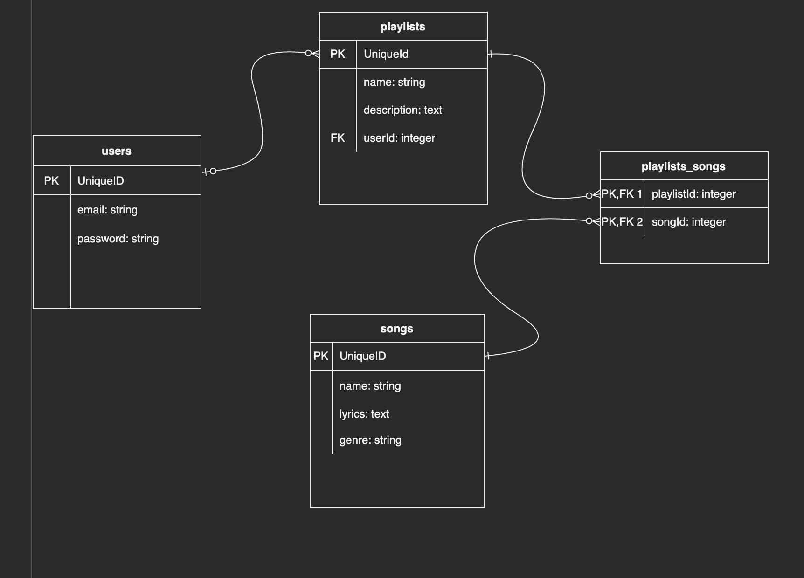
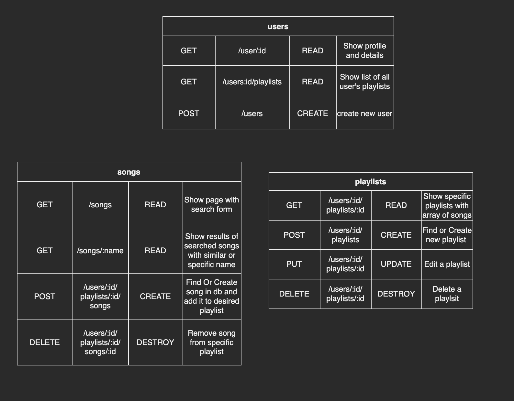

# Music App
An app where you can look up your favorite songs and create your own playlists
## Technologies Used
* Javascript
* HTML
* CSS
## API 
Musixmatch API-used for list of songs and details

## ERD and RESTful charts

## WireFrames

## MVP Goals
* Render a page that will display all user's playlists, make playlists clickable
* Render specific playlists with list of songs in it
* Render a search page with forms to look up songs
* Create buttons to add songs to playlist

## Stretch Goals
* Allow user to create multiple playlists
* Allow user to look up artists and display all artist's songs
* Render recomended songs or artists to user

## User Stories
* As a user, I want to be able to login to my account
* As a user, I want to be able to search songs
* As a user, I want to be able to create and name a playlist
* As a user, I want to be able to add and deleted songs from my playlist
* As a user, I want to be able to rename my playlist
* As a user, I want to be able view my playlist

